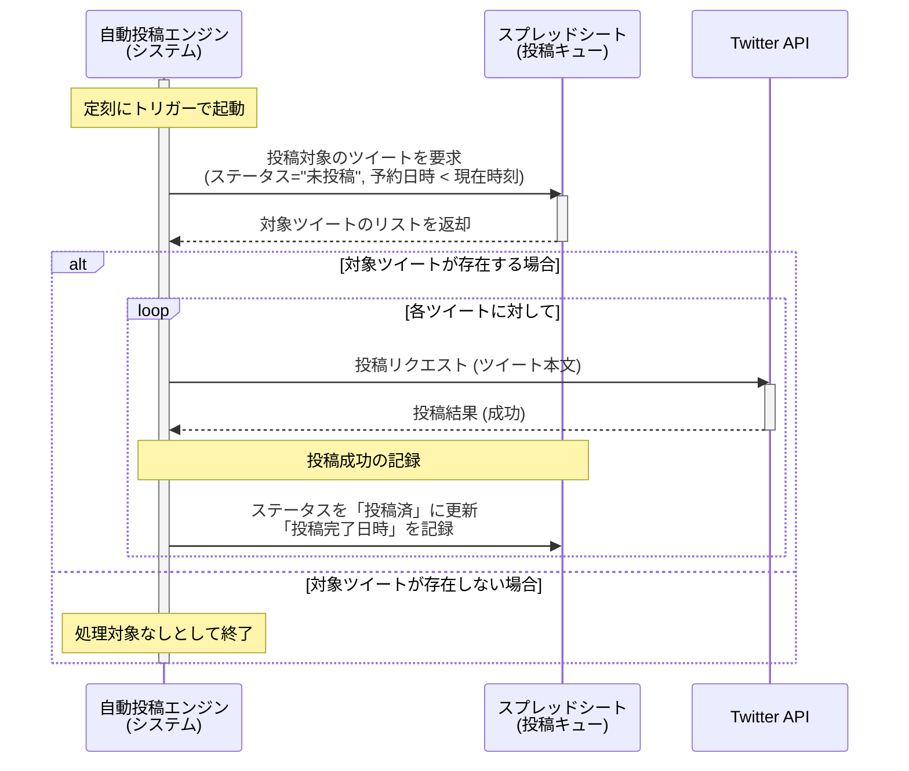

承知いたしました。ユーザーストーリー「US-001: 基本的なテキストツイートの自動投稿」に基づいたシーケンス図を作成します。

この図は、登場人物（アクター）である「自動投稿エンジン（システム）」、「スプレッドシート（投稿キュー）」、「Twitter API」の間で、どのような順序でメッセージ（情報のやり取り）が発生するかを示しています。

### US-001 自動投稿シーケンス図

### 図の解説

1.  **起動**: `自動投稿エンジン`が定刻に起動します。
2.  **データ要求**: `エンジン`は`スプレッドシート`に対して、投稿すべきツイート（未投稿かつ予約日時を過ぎたもの）のデータを要求します。
3.  **データ返却**: `スプレッドシート`は条件に合うツイートのリストを`エンジン`に返します。
4.  **ループ処理 (alt/loop)**:
      * **対象ツイートが存在する場合**: `エンジン`は取得したリストのツイート1件ずつに対してループ処理を行います。
      * **投稿リクエスト**: `エンジン`は`Twitter API`にツイートの本文を送信し、投稿をリクエストします。
      * **投稿結果**: `Twitter API`は投稿の成否を返します。この図は成功時の流れを示しています。
      * **結果の記録**: `エンジン`は投稿の成功を受けて、`スプレッドシート`上の該当ツイートのステータスを「投稿済」に更新し、「投稿完了日時」を記録します。
      * **対象ツイートが存在しない場合**: `エンジン`は何もせず、そのまま処理を終了します。