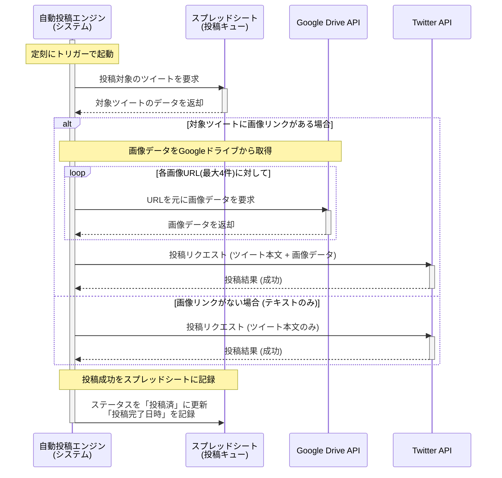

### US-002 画像付きツイート自動投稿 シーケンス図

### 図の解説

1.  **起動とデータ要求**: `自動投稿エンジン`が起動し、`スプレッドシート`から投稿すべきツイートのデータを要求します。
2.  **画像リンクの有無を判断 (alt)**:
      * **画像リンクがある場合**:
          * `エンジン`は、ツイートデータに含まれるGoogleドライブのURLを元に`Google Drive API`にアクセスします。この処理は技術タスク`TASK-003`で定義されています。
          * URLの数だけループし（`loop`）、すべての画像データを`Google Drive API`から取得します。
          * 取得したツイート本文と**画像データ**を`Twitter API`に送信して投稿します。
      * **画像リンクがない場合**:
          * US-001と同様に、ツイート本文のみを`Twitter API`に送信します。
3.  **結果の記録**: `Twitter API`から成功の応答を受け取ると、`エンジン`は`スプレッドシート`のステータスを「投稿済」に更新し、投稿日時を記録します。