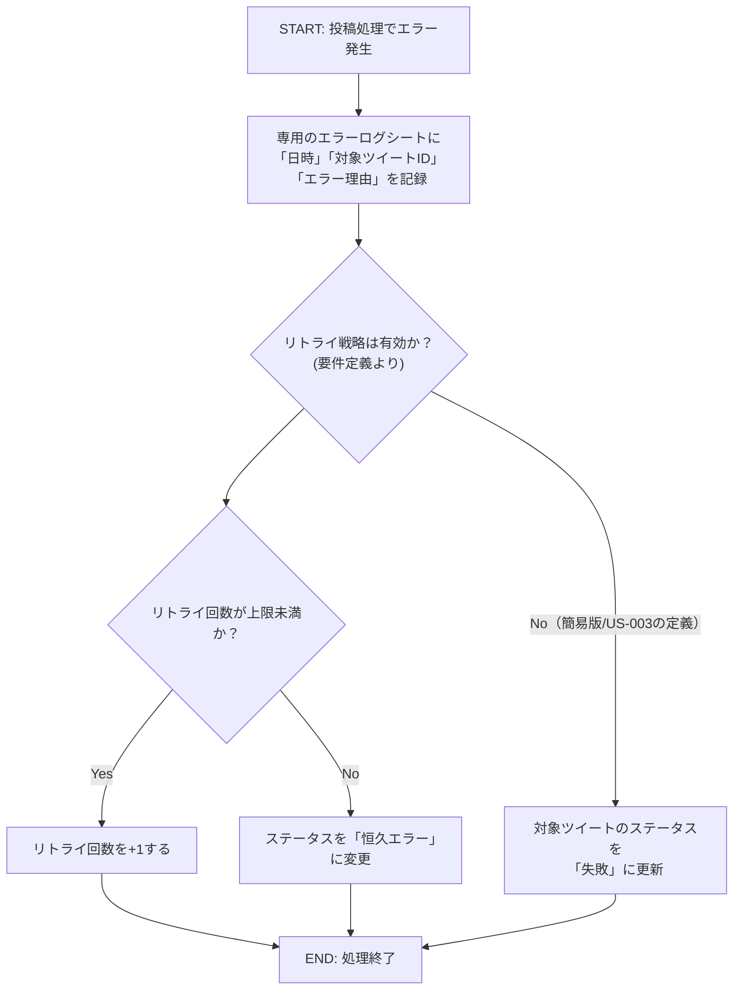

### US-003 投稿失敗記録 フローチャート

### フローチャートの解説

1.  **START: 投稿処理でエラー発生**

      * このフローは、先行するツイート投稿処理（US-001やUS-002）において、Twitter APIへの送信が失敗した時点から開始されます。

2.  **エラーログシートに情報を記録**

      * 要件定義書（FR-006）とユーザーストーリー（US-003）の定義に基づき、別の専用エラーログシートに失敗情報を追記します。
      * 記録される情報は「失敗した日時」「対象のツイートID（または内容）」「APIから返されたエラー理由」です。

3.  **リトライ戦略の有無による分岐**

      * バックログの`US-003`では、話を簡単にするため「システムが自動で再投稿を試みることはない」と定義されています。
      * 一方、要件定義書全体では、より高度なリトライ戦略（FR-007）が定義されています。
      * ここでは、より詳細な要件定義書の流れを優先しつつ、`US-003`の簡易的な定義も考慮した分岐を示しています。

4.  **リトライ回数の判定（リトライ戦略が有効な場合）**

      * ツイートごとに記録されているリトライ回数が、設定された上限値（デフォルトは3回）に達しているかを確認します。
      * **Yes (上限未満) の場合**: リトライ回数を+1して処理を終了します。ステータスは「未投稿」のままなので、次回の実行時に再度投稿が試みられます。
      * **No (上限到達) の場合**: これ以上の回復は不可能と判断し、ステータスを「恒久エラー」に変更します。これにより、以降の自動投稿の対象から除外されます。

5.  **ステータスを「失敗」に更新（リトライ戦略が無効な場合）**

      * `US-003`の簡易的な定義に従う場合、リトライは行われず、ステータスは単に「失敗」に更新されます。

6.  **END: 処理終了**

      * エラーハンドリングの処理が完了します。