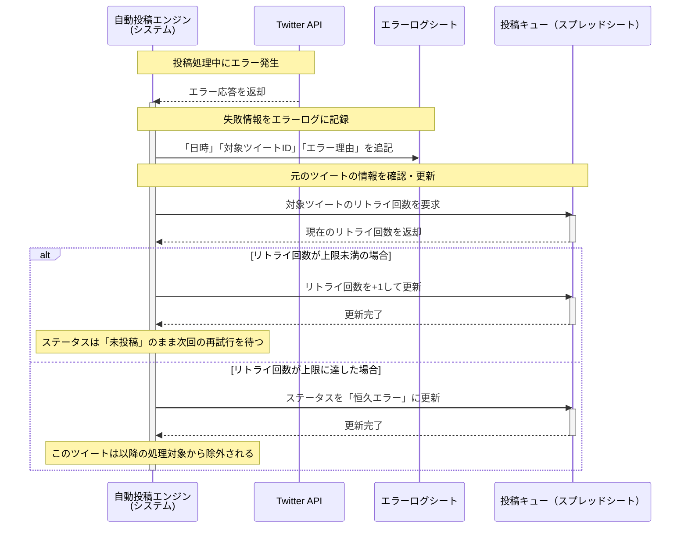

### US-003 投稿失敗記録 シーケンス図

### 図の解説

1.  **エラー発生**: `自動投稿エンジン`が`Twitter API`へ投稿をリクエストした際、`Twitter API`からエラー応答が返されます。
2.  **エラーログ記録**: `エンジン`は、まず`エラーログシート`にエラー情報を記録します。記録内容は失敗日時、対象ツイートID、エラー理由です。
3.  **リトライ回数確認**: 次に`エンジン`は、元の`投稿キュー（スプレッドシート）`にアクセスし、失敗ツイートの現在のリトライ回数を取得します。
4.  **条件分岐 (alt)**:
      * **リトライ回数が上限未満の場合**: `エンジン`はリトライ回数を+1して更新します。ステータスは「未投稿」のままなので、次回のシステム起動時に再度投稿が試みられます。
      * **リトライ回数が上限に達した場合**: `エンジン`はステータスを「恒久エラー」に更新します。これにより、このツイートは今後の自動投稿処理から除外されます。