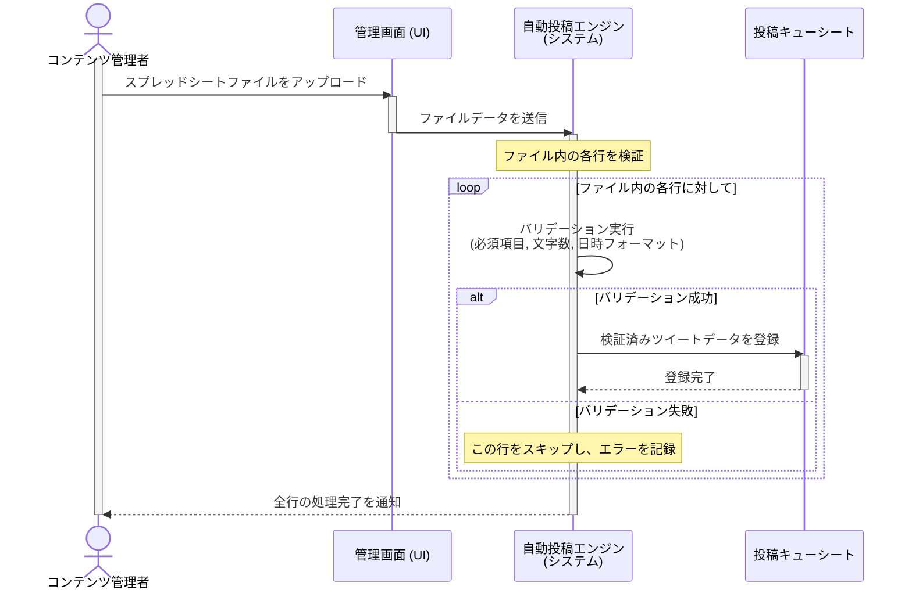

### US-004 ツイート一括予約 シーケンス図

### 図の解説

1.  **ファイルアップロード**: `コンテンツ管理者`が`管理画面(UI)`を操作して、ツイート情報が記載されたスプレッドシートファイルをアップロードします。
2.  **データ送信**: `管理画面(UI)`は受け取ったファイルデータを`自動投稿エンジン(システム)`に渡します。
3.  **ループと検証**: `エンジン`はファイルの内容を1行ずつループ処理します。
      * 各行（ツイート）に対して、`エンジン`は内部でバリデーション（検証）を実行します。検証項目は、要件定義書（FR-001）で定められている通り、「必須項目の有無」「文字数（URLは23文字換算）」「日時のフォーマット」です。
4.  **条件分岐 (alt)**:
      * **バリデーション成功の場合**: 検証を通過したツイートのデータは、`投稿キューシート`に新しい行として登録されます。
      * **バリデーション失敗の場合**: その行のデータは登録されず、エラーとして記録された後、処理は次の行に移ります。
5.  **完了通知**: `エンジン`はファイルのすべての行の処理が終わった後、`コンテンツ管理者`（またはUIを介して）に処理が完了したことを通知します。