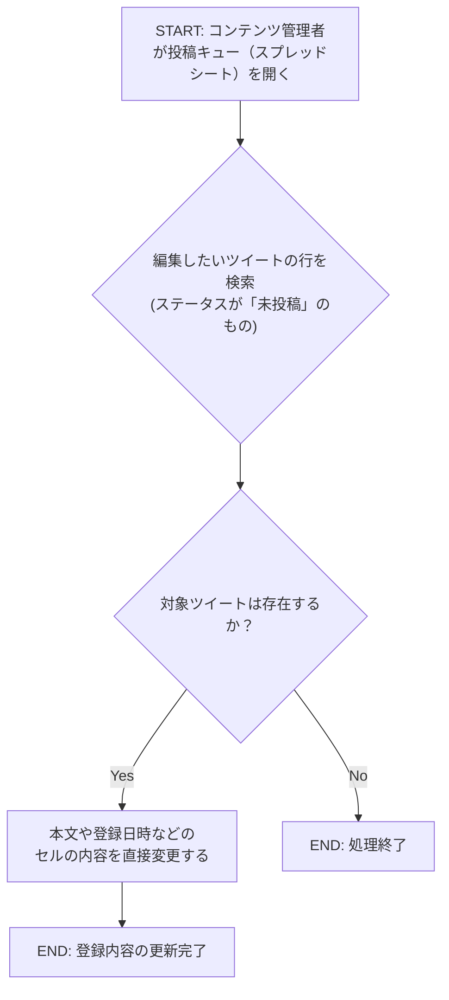
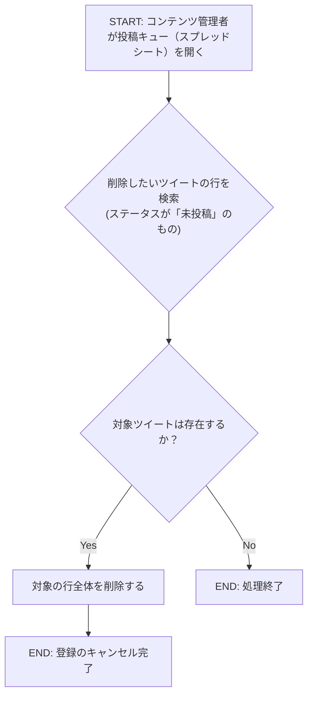

### US-005a 個別ツイート管理 フローチャート

#### 1. 新規ツイートの登録

```mermaid
graph TD
    A[START: コンテンツ管理者が投稿キュー（スプレッドシート）を開く] --> B;
    B[新しい行を追加する] --> C;
    C[必須項目(本文, 登録日時など)を入力する] --> D;
    D[ステータスを「未投稿」として入力] --> E;
    E[END: 新規ツイートの登録完了];
```

  * **解説**: コンテンツ管理者が投稿キュー（スプレッドシート）に新しい行を追加し、必要な情報を入力するだけで、システムは次回の実行時にその行を新しい登録ツイートとして自動的に認識します。

-----

#### 2. 登録ツイートの編集



  * **解説**: ステータスが「未投稿」である限り、コンテンツ管理者はセルの値を直接書き換えることで登録内容（ツイート本文や投稿時間）を自由に変更できます。システムは次回の実行時に変更後の内容を読み込みます。

-----

#### 3. 登録ツイートの削除



  * **解説**: ステータスが「未投稿」のツイートの登録をキャンセルしたい場合、コンテンツ管理者は投稿キュー（スプレッドシート）からその行を削除するだけです。行が存在しないため、システムはそれを投稿対象として認識しなくなり、登録は事実上キャンセルされます。