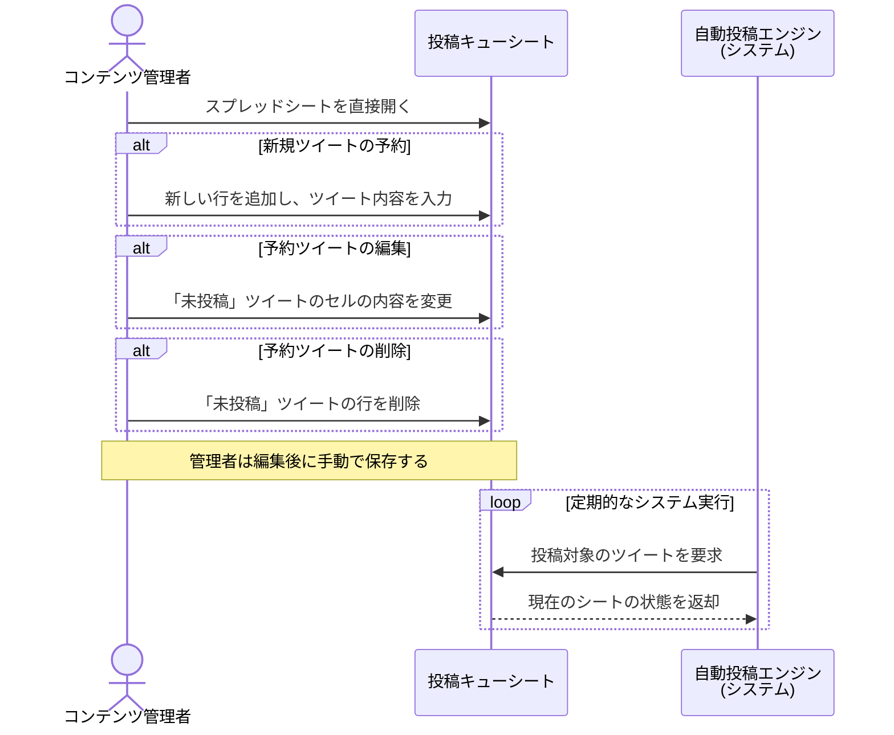

### US-005a 個別ツイート管理 シーケンス図

### 図の解説

1.  **直接編集**: `コンテンツ管理者`がGoogleスプレッドシート（`投稿キューシート`）を直接開いて操作します。
2.  **３つの操作 (alt)**:
      * **新規予約**: 管理者は新しい行を追加し、ツイートの本文や予約日時などを入力します。
      * **編集**: 既存の「未投稿」ツイートの行を見つけ、そのセルの内容を書き換えます。
      * **削除**: 不要になった「未投稿」ツイートの行を削除します。
3.  **定期的な読み込み (loop)**:
      * `自動投稿エンジン`は、これらの手動操作とは非同期に、定められたスケジュールで定期的に`投稿キューシート`にアクセスします。
      * アクセスした時点でのシートの状態（追加・変更・削除が反映された最新の状態）を読み込み、それを元に投稿処理を実行します。